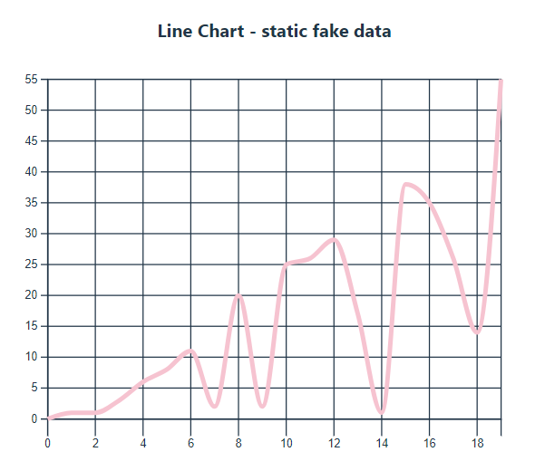
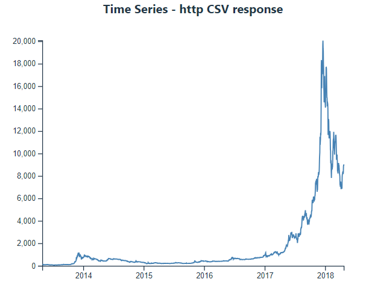
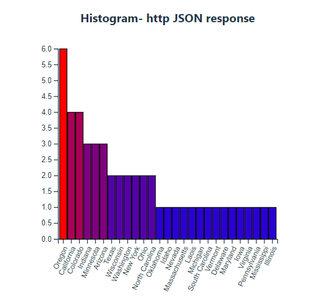

# React D3 Charts

This repository contains several chart components created in React using D3.js. The charts are dynamically rendered based on external data sources (such as JSON and CSV files) and demonstrate various types of visualizations.

## Features

- **React**: All charts are implemented as React functional components.
- **D3.js**: Used for creating and managing the SVG elements for chart rendering.
- **Dynamic Data Loading**: Data for the charts is fetched from external APIs or static files.
- **Responsive Design**: Charts resize dynamically based on the dimensions provided.
